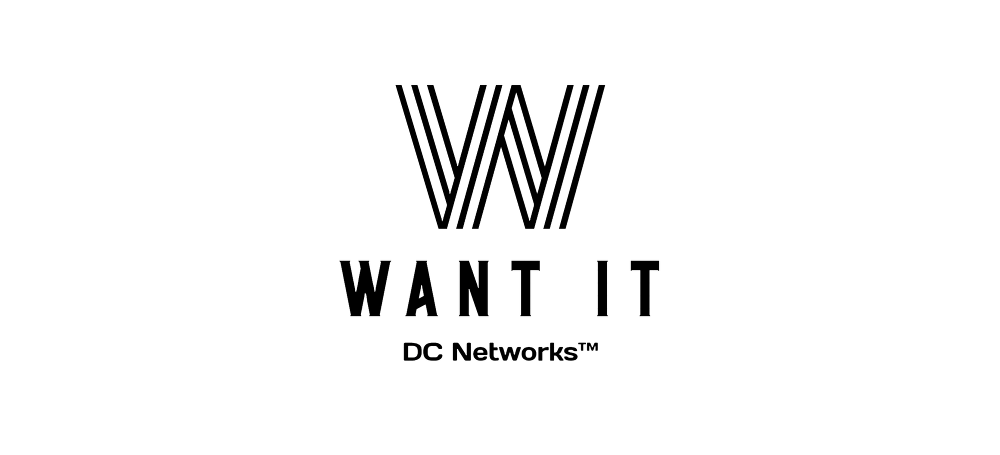

### 📄 개요

---

<h1 align="center"> Want It? </h1>
    

        경매 중개 사이트
    

    

        2024.03.26 ~ 2024.04.30
     
    

[//]: # (    <a href="https://github.com/Sonny-Trello/Readme.md"><strong>Explore the docs »</strong></a>)

[//]: # (     )

### ⚙ 개발환경

---

- 
- 
- 
- 
- 

### ✨ 기능구현

---

  

    
유저 관리 기능

    <ul>
      <li>로그인 / 회원가입 기능</li>
      <li>사용자 정보 수정 및 삭제 기능</li>
    </ul>
  

  

    
경매상품 관리 기능

    <ul>
      <li>상품 생성</li>
    </ul>
  

  

    
포인트 관리 기능

    <ul>
      <li>포인트 조회</li>
    </ul>
  

  

    
입찰 관리 기능

    <ul>
      <li>입찰 생성</li>
      <li>입찰 조회</li>
    </ul>
  

  

    
경매 좋아요 관리 기능

    <ul>
      <li>좋아요 생성</li>
    </ul>
  

  ---

[//]: # (  
)

[//]: # (    
동시성 제어
)

[//]: # (    Redis가 제공하는 분산락을 통해 가장 많은 요청이 올 것이라 예상되는 티켓 수정 메서드에서 일어날 동시성 문제를 해결함)

[//]: # (  
)

### 👯 멤버 구성

---

<table>
  <tbody>
    <tr>
      <td align="center"><a href="https://github.com/dbfjru"> <b> 👑나현승👑 </b>
      </a> </td>
      <td align="center"><a href="https://github.com/HEEEUN9812"> <b> 🐥박희은🐥 </b></a> </td>
      <td align="center"><a href="https://github.com/YOOSUNAH"> <b> 🐬유선아🐬 </b></a> </td>
      <td align="center"><a href="https://github.com/feel00k0810"> <b> ☀️장석빈☀️ </b></a> </td>
    </tr>
  </tbody>
</table>

### 📜 API 명세서

---

[Click Me!](https://teamsparta.notion.site/e402aa9d86a94accb811c184779cf33c)

### 📐 와이어프레임

---

    

### 🗂️ ERD DIAGRAM

---

    

